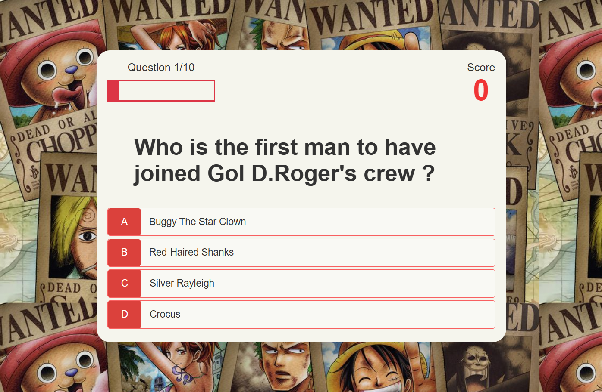

# 🏴‍☠️ SamyQuiz-OnePiece

Welcome to **SamyQuiz-OnePiece** — a fun and engaging trivia game built for fans of the *One Piece* anime and manga series! This app challenges players with a series of multiple-choice questions that test their knowledge of the One Piece world — from characters and story arcs to epic battles and hidden lore.




## 🚀 Features

- 🎯 Multiple-choice questions about One Piece
- 💾 Real time score saving using Firebase
- 📱 Responsive design for mobile and desktop

## 🔧 Technologies Used

- HTML5
- CSS3
- JavaScript (Vanilla)
- Firebase (Firestore & Hosting)

## 🎥 Live Demo

Check out the quiz here 👉 **[One Piece Quiz](https://onepiece-quiz-2022.web.app/)**

## 🛠️ Setup Instructions

- Clone the repository:
   ```bash
   git clone https://github.com/samyAkchiche/SamyQuiz-OnePiece.git

## 🧪 Coming Soon
- Leaderboard
- More questions from other anime arcs
- Sound effects and animations

## 🙌 Acknowledgements
- Inspired by the amazing world of One Piece by Eiichiro Oda
- Firebase for making backend easy
